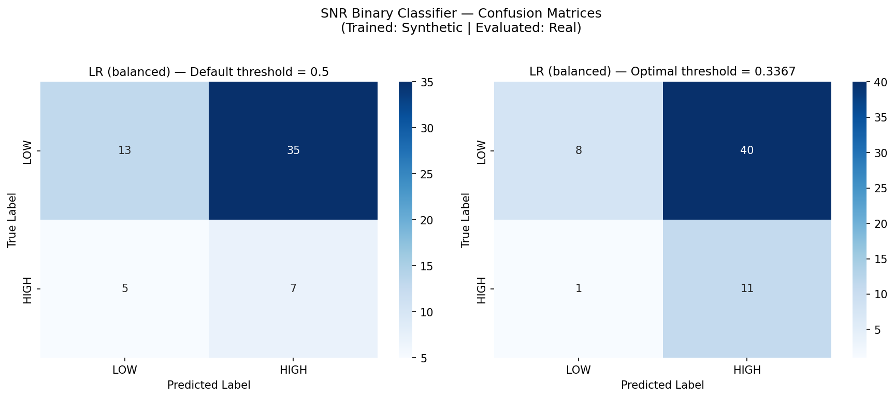
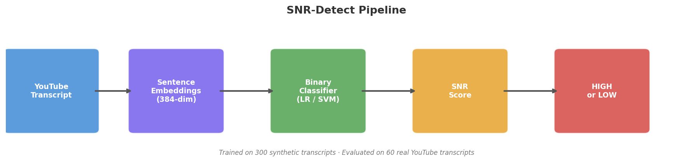

# SNR-Detect: Signal-to-Noise Ratio Detection for Educational Video Content

[](https://arxiv.org/abs/ARXIV_ID_HERE)
[](https://python.org)
[](LICENSE)

> **Can we automatically detect whether a YouTube video is worth watching?**

Educational content platforms optimize for engagement, not educational value.
A fear-mongering video about job loss can outperform a methodologically rigorous
tutorial on the same topic. SNR-Detect addresses this gap with a lightweight
binary classifier that identifies **High Signal** educational content from video
transcripts — no video watching required.

---

## What Is SNR?

Signal-to-Noise Ratio (SNR) is a framework for measuring information quality
in educational video content. We define two classes:

| Label | Description |
|-------|-------------|
| **HIGH Signal** | Concrete actionable steps, named frameworks, specific examples, methodological coherence, solution-oriented even when covering problems |
| **LOW Signal** | Generic advice, fear-based framing, promotional content, repetition without progression, logical fallacies |

---

## Results

Trained on 300 synthetic transcripts, evaluated on 60 real YouTube transcripts
labeled by LLM ensemble (GPT-4 + Gemini + Meta AI majority vote):

| Model | Accuracy | F1 (HIGH) | Precision | Recall |
|-------|----------|-----------|-----------|--------|
| Majority Baseline | 0.800 | 0.000 | 0.000 | 0.000 |
| Logistic Regression (thresh=0.337) | 0.317 | **0.349** | 0.216 | **0.917** |
| SVM RBF (thresh=0.178) | 0.267 | 0.333 | 0.204 | 0.917 |

**Key finding:** The classifier identifies 11 of 12 genuine HIGH signal
transcripts (recall = 0.917). The majority-class baseline achieves 0.800
accuracy by predicting everything as LOW — demonstrating why accuracy is the
wrong metric for imbalanced content quality tasks.

### Confusion Matrix



---

## Pipeline



```
YouTube URL → Transcript API → Sentence Embeddings → Binary Classifier → HIGH / LOW
```

1. **Fetch** — YouTube transcripts via `youtube-transcript-api`
2. **Embed** — `all-MiniLM-L6-v2` sentence transformer (384-dim vectors)
3. **Classify** — Logistic Regression trained on synthetic transcripts
4. **Output** — HIGH or LOW signal label with confidence score

---

## Dataset

| Split | Source | Size | Labels |
|-------|--------|------|--------|
| Test set | Real YouTube transcripts | 60 | LLM ensemble majority vote |
| Training set | Synthetically generated | 300 | By prompt construction |
| **Total** | | **360** | |

**Domains:** Career & Self-Improvement · Technology & AI · General Education

**LLM Ensemble:** GPT-4 (OpenAI) + Gemini 1.5 Pro (Google) + Meta AI
Labels determined by majority vote. Inter-model pairwise agreement: 53%
(vs 50% random baseline for binary classification).

**Synthetic data:** 150 HIGH + 150 LOW transcripts generated using structured
prompts. Labels assigned by construction. All prompts published for reproducibility.

**Integrity:** All labels committed to GitHub before model training.
Timestamped commit history serves as tamper-proof audit trail.

---

## Repository Structure

```
snr-detector/
├── data/
│   ├── labels/
│   │   ├── gold_dataset_binary.csv     # 60 real transcripts, binary labels
│   │   └── review_queue.csv            # Raw transcripts sent to LLM ensemble
│   └── synthetic/
│       └── synthetic_transcripts.csv   # 300 synthetic training transcripts
├── experiments/
│   └── train_binary_classifier.py      # Full embedding + classifier pipeline
├── scripts/
│   ├── fetch_transcripts.py            # YouTube transcript collection
│   └── score_youtube.py               # V1 deterministic scorer
├── src/                               # Core library modules
├── reports/
│   ├── classifier_results.json         # Full results JSON
│   └── confusion_matrix.png            # Confusion matrix visualization
├── assets/                            # README images
└── README.md
```

---

## Quickstart

```bash
# Clone
git clone https://github.com/biditdas18/snr-detector.git
cd snr-detector

# Install dependencies
pip install sentence-transformers scikit-learn pandas numpy \
            matplotlib seaborn youtube-transcript-api

# Run classifier pipeline
python experiments/train_binary_classifier.py

# Score a YouTube video
python scripts/score_youtube.py --url "https://youtube.com/watch?v=VIDEO_ID"
```

---

## Taxonomy

### HIGH Signal Criteria (all required)
1. **Methodological coherence** — ideas build logically on each other
2. **Specificity** — concrete steps, named frameworks, verifiable statistics
3. **Informational novelty** — adds perspective the viewer likely didn't have
4. **Solution orientation** — problems presented with analysis and next steps

### LOW Signal Indicators (any one sufficient if dominant)
1. Generic advice without specificity ("work hard, believe in yourself")
2. Repetition of the same point with no new information
3. Fear-based framing with no actionable solution ("we are doomed")
4. Dominant promotional content (course selling, channel plugs)
5. Logical fallacies: appeal to authority, manufactured urgency, social pressure

---

## Why LLM Annotation Instead of Human Annotation

Human annotation of educational content quality carries two unavoidable failure modes:

**Creator bias** — A viewer who associates a channel with promotional or fear-based content applies that reputation to every transcript, regardless of what the content actually says. Labels reflect creator identity, not content quality.

**Domain bias** — A software engineer rates lifestyle advice as inherently noisy. A viewer invested in immigration content rates general geopolitics as low signal. Annotation quality becomes bounded by the annotator's subject matter preferences — unacceptable for a cross-domain framework.

LLM ensemble annotation eliminates both. Language models apply the rubric without creator recognition or domain preference, producing labels that reflect content structure rather than annotator identity. This also means labels are legally clean — assigned to transcript content by rubric criteria, not to creators by name or reputation.

---

## Deployment Vision

This framework is designed for two fundamentally different deployment modes with distinct bias profiles:

**Personal deployment — bias is a feature.**
A personal SNR tool learns from your feedback. Your domain preferences and creator associations are valid personal signal. The tool warns you about content that matches your historical noise patterns and surfaces content aligned with your definition of educational value. Human bias is intentionally preserved and personalized.

**Platform deployment — bias must be eliminated.**
A recommendation filter must generalize across millions of viewers with different domain preferences and creator associations. LLM ensemble annotation — and eventually majority consensus from large-scale user feedback — washes out individual bias. Platform labels reflect population-level signal quality. YouTube's existing "was this helpful" prompt is an untapped training signal for this mode.

The two-mode architecture separates the bias question cleanly: personal tools embrace it, platform tools eliminate it.

---

## Limitations

- Silver labels from LLM ensemble (human validation planned via Prolific)
- Trained on synthetic data — synthetic-to-real domain shift observed
- YouTube only — shorter-form platforms require separate validation
- Three domains — medical, legal, financial content not yet covered
- Small real test set (n=60) — confidence intervals not reported

---

## Citation

If you use this work, please cite:

```bibtex
@article{das2025snr,
  title={Signal-to-Noise Ratio Detection in Educational Video Content:
         A Binary Classification Framework Using Transcript Embeddings},
  author={Das, Bidit},
  journal={arXiv preprint arXiv:ARXIV_ID_HERE},
  year={2025}
}
```

---

## Author

**Bidit Das** — Independent Researcher · AWS Escalation Engineer · Dallas, TX
- arXiv: [ARXIV_ID_HERE]
- GitHub: [@biditdas18](https://github.com/biditdas18)
- Medium: [@biditdas18](https://medium.com/@biditdas18)

---

*Note: Replace `ARXIV_ID_HERE` with the actual arXiv ID after submission.*
