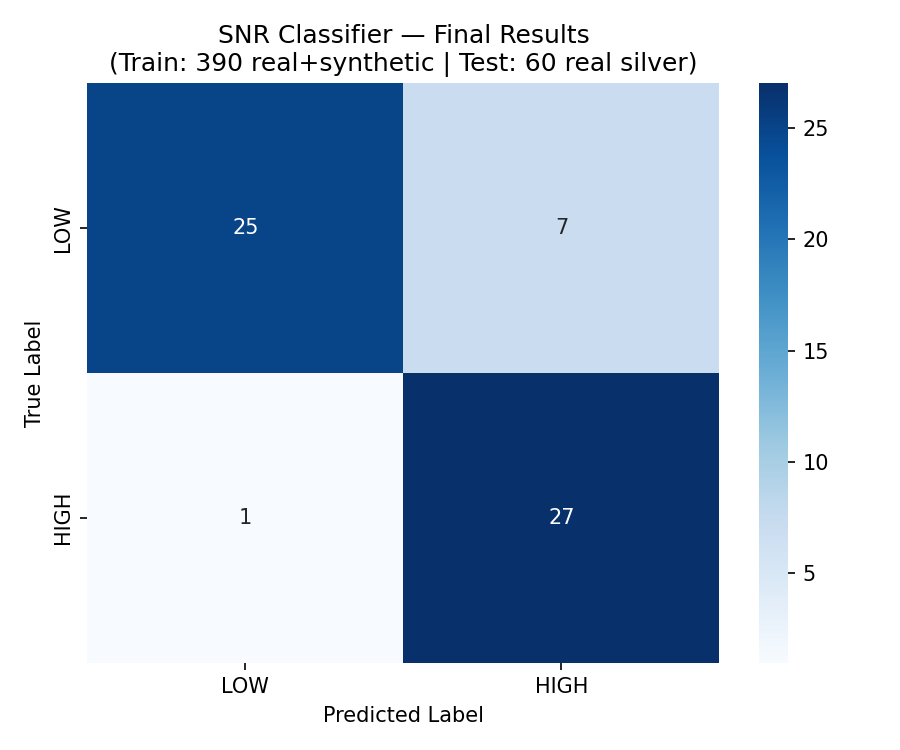

# SNR-Detector

**What this is:** A classifier that reads a YouTube video transcript
and answers one question — is this video worth watching, or is it noise?

**Why it exists:** YouTube's recommendation algorithm optimizes for
watch time and engagement, not educational value. Fear-mongering,
generic motivational content, and promotional videos get the same
algorithmic treatment as genuinely useful tutorials. This project
builds a lightweight binary classifier to distinguish the two.

**How it works:** Transcripts are embedded using a sentence-transformer
model and classified as HIGH signal (worth watching) or LOW signal
(not worth your time) using a calibrated, domain-specific rubric.

---

## Results

The best classifier (SVM) evaluated on 60 held-out real YouTube transcripts:

| Model | Accuracy | F1 | Precision | Recall |
|---|---|---|---|---|
| Baseline (predict all LOW) | 0.533 | 0.000 | — | — |
| Logistic Regression | 0.850 | 0.857 | 0.771 | 0.964 |
| **SVM RBF (best)** | **0.867** | **0.871** | **0.794** | **0.964** |

The classifier correctly identifies 96.4% of genuinely high-signal
videos (recall = 0.964). It runs in milliseconds on CPU with no API
calls at inference time.



---

## What HIGH and LOW Signal Mean

**HIGH signal** content has at least 2 of:
- Specific procedural steps with named methods, tools, or timelines
- Concrete outcomes, numbers, or named frameworks
- Ideas that build sequentially — each point adds new information
- If covering a problem: a specific action plan, not just awareness

**LOW signal** content has any of:
- Motivational language with no actionable method ("believe in yourself")
- Same point repeated multiple times with no new information
- Primary hook is fear or urgency with no solution offered
- More than 30% promotes a product, course, or service
- Confident claims with no evidence cited

The rubric is domain-specific. Career advice, tech content, and
general education are evaluated differently — what counts as
"actionable" differs by domain.

---

## Folder Structure and What Each File Does

```
snr-detector/
│
├── data/
│   ├── labels/
│   │   ├── all_150_silver_labels.csv
│   │   │   WHY: All 150 real YouTube transcripts with per-model votes
│   │   │   from the LLM ensemble (GPT-4o mini, Gemini 2.5 Flash,
│   │   │   Llama 3.3 70B) and the final majority-vote label.
│   │   │   "Silver" means LLM-labeled, not human-verified.
│   │   │
│   │   ├── test_set_final.csv
│   │   │   WHY: The 60 held-out transcripts used ONLY for evaluation.
│   │   │   Never seen during training. Locked to GitHub before any
│   │   │   model was trained (timestamped integrity proof).
│   │   │
│   │   └── train_set_final.csv
│   │       WHY: The 389 transcripts used for training.
│   │       = 89 real (labeled by LLM ensemble)
│   │       + 300 synthetic (labeled by prompt construction).
│   │       Mixing real and synthetic reduces domain shift.
│   │
│   ├── synthetic/
│   │   ├── synthetic_transcripts.csv
│   │   │   WHY: 300 transcripts generated by Claude API using
│   │   │   structured prompts. 150 HIGH + 150 LOW, 50 each per domain.
│   │   │   Labels assigned by construction — no annotation needed.
│   │   │
│   │   └── synthetic_generation_prompt.txt
│   │       WHY: The exact prompts used to generate synthetic data.
│   │       Published so anyone can reproduce the dataset from scratch.
│   │
│   └── transcripts_new/
│       WHY: The 90 new real YouTube transcripts collected to supplement
│       training. 30 per domain (career, tech, education). Stored in
│       JSONL format with video_id, url, title, channel, transcript.
│       These go into train_set_final.csv after labeling.
│       ├── new_transcripts_career_selfimprovement.jsonl
│       ├── new_transcripts_tech_ai.jsonl
│       └── new_transcripts_general_education.jsonl
│
├── experiments/
│   ├── train_final_classifier.py
│   │   WHAT: The main training and evaluation script.
│   │   Run this to reproduce the paper results.
│   │   Input:  data/labels/train_set_final.csv (train)
│   │           data/labels/test_set_final.csv (test)
│   │   Output: reports/classifier_results_final.json
│   │           reports/confusion_matrix_final.png
│   │
│   └── train_binary_classifier.py
│       WHAT: Earlier version of the classifier (synthetic-only training).
│       Results in reports/archive/. Kept for reproducibility.
│
├── scripts/
│   ├── label_150_transcripts.py
│   │   WHAT: Calls GPT-4o mini + Gemini 2.5 Flash + Llama 3.3 70B
│   │   to label all 150 real transcripts using calibrated rubrics.
│   │   NEEDS: OPENAI_API_KEY, GOOGLE_API_KEY, GROQ_API_KEY env vars.
│   │   OUTPUT: data/labels/all_150_silver_labels.csv
│   │
│   ├── build_final_datasets.py
│   │   WHAT: Splits the labeled data into train and test sets.
│   │   Run after label_150_transcripts.py.
│   │   OUTPUT: data/labels/train_set_final.csv
│   │           data/labels/test_set_final.csv
│   │
│   ├── fetch_new_transcripts.py
│   │   WHAT: Collects YouTube transcripts programmatically using
│   │   youtube-transcript-api. Run once per domain with a 2-hour
│   │   gap between domains to avoid IP rate limiting.
│   │   OUTPUT: data/transcripts_new/*.jsonl
│   │
│   └── generate_llm_eval_prompts.py
│       WHAT: Generates the evaluation prompt files used to collect
│       LLM labels interactively (via ChatGPT/Gemini web interfaces).
│       Produces files in llm_evaluation_prompts/.
│
├── llm_evaluation_prompts/
│   WHAT: Ready-to-paste prompt files sent to ChatGPT, Gemini, and
│   Meta AI to collect silver labels for the 60 evaluation transcripts.
│   Each file contains the calibrated domain-specific rubric + the
│   actual transcript text for that domain (20 transcripts per file).
│   These are NOT training prompts — they are labeling prompts.
│   ├── eval_career_selfimprovement.txt
│   ├── eval_tech_ai.txt
│   └── eval_general_education.txt
│
├── reports/
│   ├── classifier_results_final.json
│   │   WHAT: The final classifier evaluation results in JSON format.
│   │   Contains accuracy, F1, precision, recall for LR and SVM at
│   │   default and optimal thresholds. This is the paper result.
│   │
│   ├── confusion_matrix_final.png
│   │   WHAT: Confusion matrix for the best model (SVM, threshold=0.5)
│   │   trained on 389 mixed transcripts, evaluated on 60 real test set.
│   │   This is the figure in the paper.
│   │
│   └── archive/
│       WHAT: Older result files from earlier experiments.
│       confusion_matrix_synthetic_only.png — results before real data
│       classifier_results_synthetic_only.json — F1=0.349 baseline
│       baseline_v2/ — old rule-based v1 scorer artifacts
│
├── requirements.txt   — Python dependencies
├── .gitignore         — Excludes API keys, cache, OS files
└── README.md          — This file
```

---

## How to Run — Step by Step

### Option A: Just reproduce the paper results (no API keys needed)

The data is already labeled and included. Simply train and evaluate:

```bash
# 1. Clone and install
git clone https://github.com/biditdas18/snr-detector.git
cd snr-detector
pip install -r requirements.txt

# 2. Train and evaluate
python experiments/train_final_classifier.py
```

**Expected output:**

```
SVM RBF (optimal threshold=0.50):
  Accuracy:  0.867
  F1:        0.871
  Precision: 0.794
  Recall:    0.964
```

---

### Option B: Run the full pipeline from scratch (API keys required)

This re-runs everything: transcript collection, labeling, training.

**Step 1 — Collect new real transcripts (2 hours total, 3 batches)**

```bash
python scripts/fetch_new_transcripts.py --domain career
# Wait 2 hours (YouTube rate limit)
python scripts/fetch_new_transcripts.py --domain tech_ai
# Wait 2 hours
python scripts/fetch_new_transcripts.py --domain general_education
```

**Step 2 — Label all 150 transcripts via LLM ensemble**

```bash
# Set API keys (never commit these to git)
export OPENAI_API_KEY="your-openai-key"
export GOOGLE_API_KEY="your-google-key"
export GROQ_API_KEY="your-groq-key"

python scripts/label_150_transcripts.py
```

Models used: GPT-4o mini (OpenAI) + Gemini 2.5 Flash (Google) + Llama 3.3 70B (Groq)
Cost: ~$0.03 total

**Step 3 — Build train/test splits**

```bash
python scripts/build_final_datasets.py
```

**Step 4 — Train and evaluate**

```bash
python experiments/train_final_classifier.py
```

---

## Why Three Different LLM Models for Labeling?

Using one model to label creates model-specific bias. We use three
different model architectures (from three different companies) and
take the majority vote. A transcript needs 2 of 3 models to agree
before it gets a label.

Agreement rate with the calibrated domain-specific rubric:
- General Education: 96.7% weighted agreement
- Technology & AI: 81.7% weighted agreement
- Career: 70.0% weighted agreement (career self-improvement content
  is harder to calibrate — models disagree more on borderline cases)

This improved from 53% agreement with the original domain-agnostic rubric.

---

## Why Are There Synthetic Transcripts?

Getting reliable labels for real YouTube transcripts takes time and
resources. Synthetic transcripts generated from structured prompts
have perfect labels by construction — a transcript written to be
HIGH signal is labeled HIGH by definition.

The classifier trains on synthetic data to learn the patterns, then
generalizes to real transcripts at test time. Adding 89 real
transcripts to training (in addition to 300 synthetic) significantly
reduces the gap between synthetic and real content distributions.

---

## Dataset Summary

| Component | Count | Label method | Used for |
|---|---|---|---|
| Real transcripts (original 60) | 60 | LLM ensemble (calibrated rubric) | Test set only |
| Real transcripts (new 90) | 89* | LLM ensemble (calibrated rubric) | Training |
| Synthetic transcripts | 300 | By construction | Training |

*1 transcript excluded due to simultaneous API failures from 2 of 3 models.

---

## Domains Covered

- **Career & Self-Improvement** — job advice, productivity, immigration career content
- **Technology & AI** — coding tutorials, system design, AI explainers, tech news
- **General Education** — science, history, economics, geopolitics, mathematics

---

## Research Paper

This code accompanies the paper:

> **Signal-to-Noise Ratio Detection in Educational Video Content:
> A Binary Classification Framework Using Transcript Embeddings**
> Bidit Das, Independent Researcher, 2025
> arXiv: [ARXIV_ID_HERE]

The rubric calibration methodology used to generate labels is
described separately at:
> https://github.com/biditdas18/rubric-calibration-agent

---

## Author

Bidit Das — Independent Researcher
GitHub: @biditdas18 | Medium: @biditdas18

*Replace ARXIV_ID_HERE after submission.*
